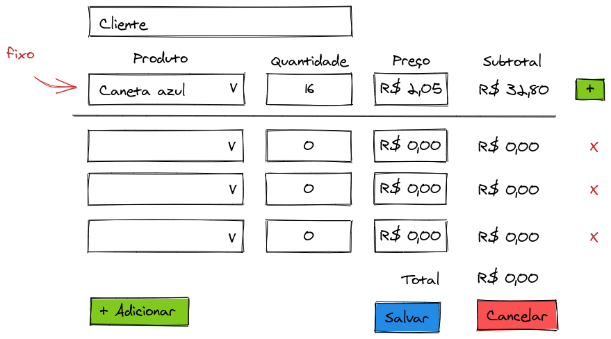

# carrinho-de-compras-django-vuejs

Este projeto tem por objetivo experimentar o uso de [VueJS](https://vuejs.org/) junto com [Django](https://www.djangoproject.com/) para simular um carrinho de compras com a intenção de eliminar o uso de [inlineformset](https://docs.djangoproject.com/en/3.1/ref/forms/models/#inlineformset-factory).

Este projeto é similar ao de [vendas](https://github.com/rg3915/vendas) onde temos essa modelagem como base.


Mas vamos usar nosso próprio modelo simplificado.


## Objetivo

Nosso objetivo é desenhar essa tela:



## Técnica

Usaremos o [VueJS](https://vuejs.org/) via [CDN](https://cdn.jsdelivr.net/npm/vue/dist/vue.js) utilizando a técnica descrita no video [Django e VueJS #01 - arquivos estáticos via cdn](https://www.youtube.com/watch?v=KOMER5MhBlY), onde o VueJS será usado como arquivo estático dentro da pasta `/static/js/`.

Neste caso teremos conflito de delimitadores. Para resolver isso usamos o seguinte delimitador no VueJS:

```
${  }
```

Os estáticos do VueJS via CDN estão declarados em `base.html`.


## Este projeto foi feito com:

* [Python 3.8.2](https://www.python.org/)
* [Django 2.2.19](https://www.djangoproject.com/)
* [Bootstrap 4.0](https://getbootstrap.com/)
* [VueJS 2.6.11](https://vuejs.org/)

## Como rodar o projeto?

* Clone esse repositório.
* Crie um virtualenv com Python 3.
* Ative o virtualenv.
* Instale as dependências.
* Rode as migrações.

```
git clone https://github.com/rg3915/carrinho-de-compras-django-vuejs.git
cd carrinho-de-compras-django-vuejs
python3 -m venv .venv
source .venv/bin/activate
pip install -r requirements.txt
python contrib/env_gen.py
python manage.py migrate
python manage.py create_data
python manage.py createsuperuser --username="admin" --email=""
python manage.py runserver
```


## Passo a passo

### Criar o projeto inicial

```
git clone https://gist.github.com/b363f5c4a998f42901705b23ccf4b8e8.git /tmp/boilerplatesimple
ls /tmp/boilerplatesimple
cp /tmp/boilerplatesimple/boilerplatesimple.sh .
source boilerplatesimple.sh
# Após terminar de instalar delete o arquivo boilerplatesimple.sh
rm -f boilerplatesimple.sh
```

### Criar app shopping

```
cd myproject
python ../manage.py startapp shopping
```

E em `settings.py` faça

```python
INSTALLED_APPS = [
    ...
    'myproject.core',
    'myproject.shopping',
]
```


#### Criar modelo

```python
# shopping/models.py
from django.db import models


class Shop(models.Model):
    customer = models.CharField('cliente', max_length=100)
    created = models.DateTimeField('criado em', auto_now_add=True, auto_now=False)

    class Meta:
        ordering = ('-pk',)
        verbose_name = 'compra'
        verbose_name_plural = 'compras'

    def __str__(self):
        return self.customer


class Product(models.Model):
    name = models.CharField('nome', max_length=100, unique=True)
    price = models.DecimalField('preço', max_digits=6, decimal_places=2)

    class Meta:
        ordering = ('name',)
        verbose_name = 'produto'
        verbose_name_plural = 'produtos'

    def __str__(self):
        return self.name

    def to_dict(self):
        return {
            'value': self.pk,
            'text': self.name,
            'price': self.price
        }


class Cart(models.Model):
    shop = models.ForeignKey(
        Shop,
        related_name='compras',
        on_delete=models.CASCADE
    )
    product = models.ForeignKey(
        Product,
        related_name='products',
        on_delete=models.SET_NULL,
        null=True,
        blank=True
    )
    quantity = models.PositiveIntegerField('quantidade')
    price = models.DecimalField('preço', max_digits=6, decimal_places=2)

    class Meta:
        ordering = ('-pk',)
        verbose_name = 'carrinho'
        verbose_name_plural = 'carrinhos'

    def __str__(self):
        if self.shop:
            return f'{self.shop.pk}-{self.pk}-{self.product}'
        return str(self.pk)

    def get_subtotal(self):
        return self.price * (self.quantity or 0)
```

### Criar url e views

```python
# urls.py
from django.urls import include, path
from django.contrib import admin


urlpatterns = [
    path('', include('myproject.core.urls', namespace='core')),
    # path('shopping/', include('myproject.shopping.urls', namespace='shopping')),
    path('admin/', admin.site.urls),
]
```

```python
# core/urls.py
from django.urls import path
from myproject.core import views as v


app_name = 'core'


urlpatterns = [
    path('', v.index, name='index'),
]
```

```python
# core/views.py
from django.shortcuts import render


def index(request):
    return render(request, 'index.html')
```

### Criar os templates

* Criar `nav.html`, `base.html` e `index.html`

```
cd ..
mkdir -p myproject/core/templates/includes
touch myproject/core/templates/includes/nav.html
touch myproject/core/templates/{base,index}.html
```

Editar `nav.html`

```html
<!-- includes/nav.html -->
<!-- https://getbootstrap.com/docs/4.0/examples/starter-template/ -->
<!-- https://github.com/JTruax/bootstrap-starter-template/blob/master/template/start.html -->

<nav class="navbar navbar-expand-md navbar-dark bg-dark fixed-top">
    <a class="navbar-brand" href="">Carrinho de compras</a>
    <button class="navbar-toggler" type="button" data-toggle="collapse" data-target="#navbarsExampleDefault" aria-controls="navbarsExampleDefault" aria-expanded="false" aria-label="Toggle navigation">
        <span class="navbar-toggler-icon"></span>
    </button>

    <div class="collapse navbar-collapse" id="navbarsExampleDefault">
        <ul class="navbar-nav mr-auto">
            <li class="nav-item active">
                <a class="nav-link" href="">Home <span class="sr-only">(current)</span></a>
            </li>
        </ul>
    </div>
</nav>
```

Editar `base.html`

```html
<!-- base.html -->

<!DOCTYPE html>
<html lang="en">
<head>
  <meta charset="UTF-8">
  <meta name="viewport" content="width=device-width, initial-scale=1.0">
  <link rel="shortcut icon" href="https://www.djangoproject.com/favicon.ico">
  <title>Carrinho de compras</title>

  <!-- Bootstrap core CSS -->
  <link rel="stylesheet" href="https://stackpath.bootstrapcdn.com/bootstrap/4.4.1/css/bootstrap.min.css">

  <!-- Font-awesome -->
  <link rel="stylesheet" href="https://maxcdn.bootstrapcdn.com/font-awesome/4.7.0/css/font-awesome.min.css">

  <link rel="stylesheet" href="">

  <style>
    body {
      margin-top: 70px;
    }
  </style>

</head>
<body>

  

  <div class="container">
    
  </div>

  <!-- VueJS -->
  <script src="https://cdn.jsdelivr.net/npm/vue/dist/vue.js"></script>

  <!-- axios -->
  <script src="https://cdn.jsdelivr.net/npm/axios/dist/axios.min.js"></script>

  

</body>
</html>
```

Editar `index.html`

```html
<!-- index.html -->




  <div class="jumbotron text-center">
    <p>Este é um projeto feito com <a href="https://www.djangoproject.com/" target="_blank">Django</a> e <a href="https://vuejs.org/" target="_blank">VueJS</a>.</p>
    <p>
      <a href="https://github.com/rg3915/carrinho-de-compras-django-vuejs" target="_blank">Veja no GitHub</a>
    </p>
    <a class="btn btn-primary" href="">Fazer uma compra</a>
  </div>

```

Rodar a aplicação até aqui.

> Talvez você tenha que tirar a url de index temporariamente.


* Criar visualização para `shopping.html`

```python
# shopping/views.py
from django.shortcuts import render


def shopping(request):
    template_name = 'shopping.html'
    return render(request, template_name)
```

```
touch shopping/urls.py
```

```python
# shopping/urls.py
from django.urls import path
from myproject.shopping import views as v


app_name = 'shopping'


urlpatterns = [
    path('shopping/', v.shopping, name='shopping'),
]
```

Acrescente em `urls.py`

```python
# urls.py
...
path('shopping/', include('myproject.shopping.urls', namespace='shopping')),
...
```

```
mkdir -p myproject/shopping/templates
touch myproject/shopping/templates/shopping.html
```

```html
<!-- shopping.html -->




<div class="text-center">
  <div class="row">
    <div class="col-8">
      <form action="." method="POST">
        <input id="id_customer" class="form-control" type="text" placeholder="Cliente" />
      </form>

      <div class="mt-4">
        <table class="table table-hover table-borderless">
          <thead>
            <tr>
              <th>Produto</th>
              <th>Quantidade</th>
              <th>Preço</th>
              <th>Subtotal</th>
              <th></th>
            </tr>
          </thead>
          <tbody class="mytable">
            <tr>
              <td>
                <input class="form-control" type="text" placeholder="Caneta azul" />
              </td>
              <td>
                <input class="form-control text-center" type="number" min="0" placeholder="16" />
              </td>
              <td>
                <div class="input-group mb-3">
                  <div class="input-group-prepend">
                    <span class="input-group-text" id="basic-addon1">R$</span>
                  </div>
                  <input class="form-control" type="number" min="0" placeholder="2,05">
                </div>
              </td>
              <td>
                <div class="input-group mb-3">
                  <div class="input-group-prepend">
                    <span class="input-group-text" id="basic-addon1">R$</span>
                  </div>
                  <input class="form-control" type="number" min="0" placeholder="32,80">
                </div>
              </td>
              <td>
                <button class="btn btn-success">
                  <i class="fa fa-plus"></i>
                </button>
              </td>
            </tr>
          </tbody>
        </table>

        <hr>

        <table class="table table-hover table-borderless mt-3">
          <tbody>
            <tr>
              <td>
                <input class="form-control" type="text" placeholder="Caneta azul" />
              </td>
              <td>
                <input class="form-control text-center" type="number" min="0" placeholder="16" />
              </td>
              <td>
                <div class="input-group mb-3">
                  <div class="input-group-prepend">
                    <span class="input-group-text" id="basic-addon1">R$</span>
                  </div>
                  <input class="form-control" type="number" min="0" placeholder="2,05">
                </div>
              </td>
              <td>
                <div class="input-group mb-3">
                  <div class="input-group-prepend">
                    <span class="input-group-text" id="basic-addon1">R$</span>
                  </div>
                  <input class="form-control" type="number" min="0" placeholder="32,80">
                </div>
              </td>
              <td>
                <button class="btn btn-link">
                  <i class="fa fa-close close"></i>
                </button>
              </td>
            </tr>

            <tr>
              <td>
                <input class="form-control" type="text" placeholder="Caneta azul" />
              </td>
              <td>
                <input class="form-control text-center" type="number" min="0" placeholder="16" />
              </td>
              <td>
                <div class="input-group mb-3">
                  <div class="input-group-prepend">
                    <span class="input-group-text" id="basic-addon1">R$</span>
                  </div>
                  <input class="form-control" type="number" min="0" placeholder="2,05">
                </div>
              </td>
              <td>
                <div class="input-group mb-3">
                  <div class="input-group-prepend">
                    <span class="input-group-text" id="basic-addon1">R$</span>
                  </div>
                  <input class="form-control" type="number" min="0" placeholder="32,80">
                </div>
              </td>
              <td>
                <button class="btn btn-link">
                  <i class="fa fa-close close"></i>
                </button>
              </td>
            </tr>

            <tr>
              <td>
                <input class="form-control" type="text" placeholder="Caneta azul" />
              </td>
              <td>
                <input class="form-control text-center" type="number" min="0" placeholder="16" />
              </td>
              <td>
                <div class="input-group mb-3">
                  <div class="input-group-prepend">
                    <span class="input-group-text" id="basic-addon1">R$</span>
                  </div>
                  <input class="form-control" type="number" min="0" placeholder="2,05">
                </div>
              </td>
              <td>
                <div class="input-group mb-3">
                  <div class="input-group-prepend">
                    <span class="input-group-text" id="basic-addon1">R$</span>
                  </div>
                  <input class="form-control" type="number" min="0" placeholder="32,80">
                </div>
              </td>
              <td>
                <button class="btn btn-link">
                  <i class="fa fa-close close"></i>
                </button>
              </td>
            </tr>

            <tr>
              <td>
                <input class="form-control" type="text" placeholder="Caneta azul" />
              </td>
              <td>
                <input class="form-control text-center" type="number" min="0" placeholder="16" />
              </td>
              <td>
                <div class="input-group mb-3">
                  <div class="input-group-prepend">
                    <span class="input-group-text" id="basic-addon1">R$</span>
                  </div>
                  <input class="form-control" type="number" min="0" placeholder="2,05">
                </div>
              </td>
              <td>
                <div class="input-group mb-3">
                  <div class="input-group-prepend">
                    <span class="input-group-text" id="basic-addon1">R$</span>
                  </div>
                  <input class="form-control" type="number" min="0" placeholder="32,80">
                </div>
              </td>
              <td>
                <button class="btn btn-success">
                  <i class="fa fa-plus"></i>
                </button>
              </td>
            </tr>
          </tbody>
          <tfoot>
            <tr class="lead">
              <th colspan="3" class="text-right">Total</th>
              <th class="text-left">R$ <span class="pull-right">125,38</span></th>
            </tr>
          </tfoot>
        </table>
      </div>

    </div>
  </div>
</div>


```

```
mkdir -p myproject/core/static/{css,js}
touch myproject/core/static/css/style.css
touch myproject/core/static/js/app.js
```

Editar `style.css`

```css
/* style.css */
hr {
  margin-top: 0;
  margin-bottom: 0;
}
.mm-2 {
  margin-top: 0.5rem;
  margin-bottom: 0.5rem;
}
.table {
  margin-bottom: 0;
}
.table td {
  padding: 0 .75rem;
  vertical-align: middle;
}
.mytable tr td {
  padding-top: 0;
  padding-bottom: 0;
}
.w15 {
  width: 15%;
}
.w40 {
  width: 40%;
}
.close {
  color: red;
}
```

Versão com ajustes de CSS:

```html
<!-- shopping.html -->





<div id="app" class="text-center">
  <div class="row">
    <div class="col-10">
      <form action="." method="POST">
        <input id="id_customer" class="form-control" type="text" placeholder="Cliente" />
      </form>

      <div class="mt-4">
        <table class="table table-hover table-borderless">
          <thead>
            <tr>
              <th>Produto</th>
              <th>Quantidade</th>
              <th>Preço</th>
              <th>Subtotal</th>
              <th></th>
            </tr>
          </thead>
          <tbody class="mytable">
            <tr>
              <td class="w40">
                <input class="form-control" type="text" placeholder="Caneta azul" />
              </td>
              <td>
                <input class="form-control text-center" type="number" min="0" placeholder="16" />
              </td>
              <td>
                <div class="input-group mm-2">
                  <div class="input-group-prepend">
                    <span class="input-group-text" id="basic-addon1">R$</span>
                  </div>
                  <input class="form-control" type="number" min="0" placeholder="2,05">
                </div>
              </td>
              <td class="w15">
                <div class="d-flex input-group mm-2">
                  <div>R$</div>
                  <div class="ml-auto">32,80</div>
                </div>
              </td>
              <td>
                <button class="btn btn-success">
                  <i class="fa fa-plus"></i>
                </button>
              </td>
            </tr>
          </tbody>
        </table>

        <hr>

        <table class="table table-hover table-borderless">
          <tbody>
            <tr v-for="cart in cartItems" :key="cart.id">
              <td class="w40">
                <input class="form-control" type="text" :value="[[ cart.product ]]" />
              </td>
              <td>
                <input class="form-control text-center" type="number" min="0" :value="[[ cart.quantity ]]" />
              </td>
              <td>
                <div class="input-group mm-2">
                  <div class="input-group-prepend">
                    <span class="input-group-text" id="basic-addon1">R$</span>
                  </div>
                  <input class="form-control" type="number" min="0" step="0.01" :value="[[ cart.price ]]">
                </div>
              </td>
              <td class="w15">
                <div class="d-flex input-group mm-2">
                  <div>R$</div>
                  <div class="ml-auto">${ (cart.price * cart.quantity) | formatPrice }</div>
                </div>
              </td>
              <td>
                <button class="btn btn-link">
                  <i class="fa fa-close close"></i>
                </button>
              </td>
            </tr>

            <tr>
              <td class="w40">
                <input class="form-control" type="text" placeholder="Caneta azul" />
              </td>
              <td>
                <input class="form-control text-center" type="number" min="0" placeholder="16" />
              </td>
              <td>
                <div class="input-group mm-2">
                  <div class="input-group-prepend">
                    <span class="input-group-text" id="basic-addon1">R$</span>
                  </div>
                  <input class="form-control" type="number" min="0" placeholder="2,05">
                </div>
              </td>
              <td class="w15">
                <div class="d-flex input-group mm-2">
                  <div>R$</div>
                  <div class="ml-auto">32,80</div>
                </div>
              </td>
              <td>
                <button class="btn btn-success">
                  <i class="fa fa-plus"></i>
                </button>
              </td>
            </tr>
          </tbody>
          <tfoot>
            <tr class="lead">
              <th colspan="3" class="text-right">Total</th>
              <th class="text-left">R$ <span class="pull-right">${ cartValue | formatPrice }</span></th>
            </tr>
          </tfoot>
        </table>
      </div>

    </div>
  </div>
</div>




  <script src=""></script>

```

Mostrar

```
${ (cart.price * cart.quantity) | formatPrice }

${ cartValue | formatPrice }
```

> Mostrar a aplicação rodando.

Versão final

```html
<!-- shopping.html -->





<div id="app" class="text-center">
  <div class="row">
    <div class="col-10">
      <form action="." method="POST">
        <input id="customer" class="form-control" type="text" v-model="form.customer" placeholder="Cliente" />
      </form>

      <div class="mt-4">
        <table class="table table-hover table-borderless">
          <thead>
            <tr>
              <th>Produto</th>
              <th>Quantidade</th>
              <th>Preço</th>
              <th>Subtotal</th>
              <th></th>
            </tr>
          </thead>
          <tbody class="mytable">
            <tr>
              <td class="w40">
                <select id="productName" class="form-control" v-model="currentProduct.pk">
                  <option selected value="">---</option>
                  <option v-for="product in products" :key="product.value" :value="product.value">${ product.text }</option>
                </select>
              </td>
              <td>
                <input id="productQuantity" class="form-control text-center" type="number" min="0" v-model="currentProduct.quantity" />
              </td>
              <td>
                <div class="input-group mm-2">
                  <div class="input-group-prepend">
                    <span class="input-group-text" id="basic-addon1">R$</span>
                  </div>
                  <input id="productPrice" class="form-control" type="number" min="0" step="0.01" v-model="currentProduct.price">
                </div>
              </td>
              <td class="w15">
                <div class="d-flex input-group mm-2">
                  <div>R$</div>
                  <div class="ml-auto">${ (currentProduct.price * currentProduct.quantity) | formatPrice }</div>
                </div>
              </td>
              <td>
                <button id="btnSubmit" class="btn btn-success" @click="addProduct">
                  <i class="fa fa-plus"></i>
                </button>
              </td>
            </tr>
          </tbody>
        </table>

        <hr>

        <table id="myTable" class="table table-hover table-borderless">
          <tbody>
            <tr v-for="(cart, i) in cartItems" :key="i">
              <td class="w40">
                <select :id="'name'+i" class="form-control" v-model="cart.pk">
                  <option selected value="">---</option>
                  <option v-for="product in products" :key="product.value" :value="product.value">${ product.text }</option>
                </select>
              </td>
              <td>
                <input :id="'quantity'+i" class="form-control text-center" type="number" min="0" v-model="cart.quantity" />
              </td>
              <td>
                <div class="input-group mm-2">
                  <div class="input-group-prepend">
                    <span class="input-group-text" id="basic-addon1">R$</span>
                  </div>
                  <input :id="'price'+i" class="form-control" type="number" min="0" step="0.01" v-model="cart.price" />
                </div>
              </td>
              <td class="w15">
                <div class="d-flex input-group mm-2">
                  <div>R$</div>
                  <div class="ml-auto">${ (cart.price * cart.quantity) | formatPrice }</div>
                </div>
              </td>
              <td>
                <button class="btn btn-link">
                  <i class="fa fa-close close" @click="deleteProduct(cart)"></i>
                </button>
              </td>
            </tr>
          </tbody>
          <tfoot class="lead">
            <tr>
              <th colspan="3" class="text-right">Total</th>
              <th class="text-left">R$ <span class="pull-right">${ cartValue | formatPrice }</span></th>
              <th></th>
            </tr>
            <tr>
              <th class="text-left">
                <button id="btnAddLine" class="btn btn-success" @click="addLine">
                  <i class="fa fa-plus"></i> Adicionar
                </button>
              </th>
              <th colspan="2" class="text-right">
                <button id="btnSave" class="btn btn-primary" @click="submitForm">
                  <i class="fa fa-floppy-o"></i> Salvar
                </button>
              </th>
              <th class="text-right">
                <button id="btnCancel" class="btn btn-danger" @click="resetForm">
                  <i class="fa fa-close"></i> Cancelar
                </button>
              </th>
            </tr>
          </tfoot>
        </table>
      </div>

    </div>
  </div>
</div>




  <script src=""></script>

```


Adicione uma nova rota em `core/urls.py`

```python
    path('api/products/', v.api_product, name='api_product'),
```

Em `core/views.py`

```python
from django.shortcuts import render
from django.http import JsonResponse
from myproject.shopping.models import Product


def index(request):
    return render(request, 'index.html')


def api_product(request):
    products = Product.objects.all()
    data = [item.to_dict() for item in products]
    response = {'data': data}
    return JsonResponse(response)
```

Editar `shopping/admin.py`

```python
# shopping/admin.py
from django.contrib import admin
from .models import Shop, Product, Cart


class CartInline(admin.TabularInline):
    model = Cart
    extra = 0


@admin.register(Shop)
class ShopAdmin(admin.ModelAdmin):
    inlines = (CartInline,)
    list_display = ('__str__', 'created')
    search_fields = ('customer',)


@admin.register(Product)
class ProductAdmin(admin.ModelAdmin):
    list_display = ('__str__', 'price')
    search_fields = ('name',)


@admin.register(Cart)
class CartAdmin(admin.ModelAdmin):
    list_display = ('__str__', 'shop', 'quantity', 'price')
    search_fields = ('shop__customer', 'product__name')
```

Mostrar a url `/api/products/`.

Cadastrar alguns produtos em admin.

Para isso eu criei um [CSV](fix/produtos.csv) e um comando [create_data](myproject/core/management/commands/create_data.py) pra criar os dados.

Em `core/static/js/app.js`

```js
axios.defaults.xsrfHeaderName = 'X-CSRFToken'
axios.defaults.xsrfCookieName = 'csrftoken'

const endpoint = 'http://localhost:8000/'

Vue.filter("formatPrice", value => (value / 1).toFixed(2).replace('.', ',').toString().replace(/\B(?=(\d{3})+(?!\d))/g, "."))

var app = new Vue({
  el: '#app',
  delimiters: ['${', '}'],
  data: {
    form: {
      customer: null
    },
    cartItems: [],
    currentProduct: {
      pk: null,
      quantity: 0,
      price: 0.0
    },
    products: []
  },
  mounted() {
    axios.get(endpoint + 'api/products/')
      .then(response => {
        this.products = response.data.data;
      })
  },
  computed: {
    cartValue() {
      return this.cartItems.reduce((prev, curr) => {
        return prev + (curr.price * curr.quantity)
      }, 0).toFixed(2)
    }
  },
  methods: {
    submitForm() {
      let bodyFormData = new FormData();

      bodyFormData.append('products', JSON.stringify(this.cartItems));
      bodyFormData.append('customer', JSON.stringify(this.form.customer));

      axios.post('/api/shopping-items/add/', bodyFormData)
        .then((res) => {
          location.href = endpoint + 'shopping/cart-items/' + res.data.data
        })
    },
    addProduct() {
      this.cartItems.push(this.currentProduct)
      this.currentProduct = {
        pk: null,
        quantity: 0,
        price: 0.0
      }
    },
    addLine() {
      this.cartItems.push(
        {
          pk: null,
          quantity: 0,
          price: 0.0
        }
      )
    },
    deleteProduct(item) {
      var idx = this.cartItems.indexOf(item)
      this.cartItems.splice(idx, 1)
    },
    resetForm() {
      this.form = {
        customer: null
      }
      this.cartItems = []
      this.currentProduct = {
        pk: null,
        quantity: 0,
        price: 0.0
      }
    }
  }
})
```


Em `core/urls.py`

```python
    path('api/shopping-items/add/', v.api_shopping_items_add, name='api_shopping_items_add'),
```

Em `core/views.py`

```python
import json
from django.http import JsonResponse
from django.shortcuts import render
from django.views.decorators.csrf import csrf_exempt
from myproject.shopping.models import Product, Shop, Cart


@csrf_exempt
def api_shopping_items_add(request):
    request = request.POST
    customer = json.loads(request.get('customer'))
    products = json.loads(request.get('products'))

    shop = Shop.objects.create(customer=customer)

    for product in products:
        product_obj = Product.objects.get(pk=product['pk'])
        quantity = product['quantity']
        price = product['price']

        Cart.objects.create(
            shop=shop,
            product=product_obj,
            quantity=quantity,
            price=price
        )
    response = {'data': shop.pk}
    return JsonResponse(response)
```

Em `shopping/urls.py`

```python
    path('cart-items/<int:pk>/', v.cart_items, name='cart_items'),
```

Em `shopping/views.py`

```python
def cart_items(request, pk):
    template_name = 'cart_items.html'
    carts = Cart.objects.filter(shop=pk)

    qs = carts.values_list('price', 'quantity') or 0
    total = sum(map(lambda q: q[0] * q[1], qs))

    context = {'object_list': carts, 'total': total}
    return render(request, template_name, context)
```

E crie `cart_items.html`

```
touch myproject/shopping/templates/cart_items.html
```

```html
<!-- cart_items.html -->





<div id="app" class="text-center">
  <div class="row">
    <div class="col-10">
      <div class="mt-4">
        <h3 class="text-left">Confirmação de compra</h3>
        <table class="table table-hover">
          <thead>
            <tr>
              <th class="text-left">Produto</th>
              <th>Quantidade</th>
              <th>Preço</th>
              <th>Subtotal</th>
            </tr>
          </thead>
          <tbody>
            
              <tr>
                <td class="text-left">{{ object.product.name }}</td>
                <td>{{ object.quantity }}</td>
                <td>
                  <div class="d-flex">
                    <div>R$</div>
                    <div class="ml-auto">{{ object.price }}</div>
                  </div>
                </td>
                <td>
                  <div class="d-flex">
                    <div>R$</div>
                    <div class="ml-auto">{{ object.get_subtotal }}</div>
                  </div>
                </td>
              </tr>
            
          </tbody>
          <tfoot>
            <tr>
              <th colspan="3" class="text-right">Total</th>
              <th>
                <div class="d-flex">
                  <div>R$</div>
                  <div class="ml-auto">{{ total }}</div>
                </div>
              </th>
            </tr>
          </tfoot>
        </table>
      </div>
    </div>
  </div>
</div>


```
